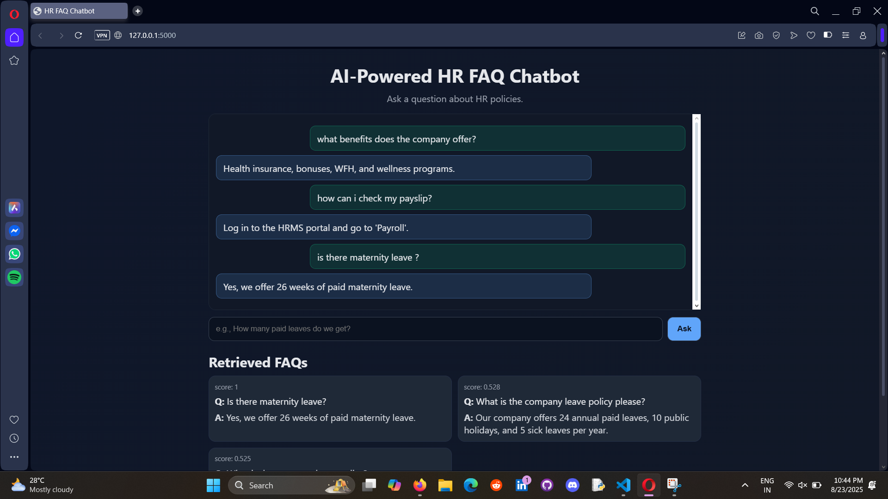
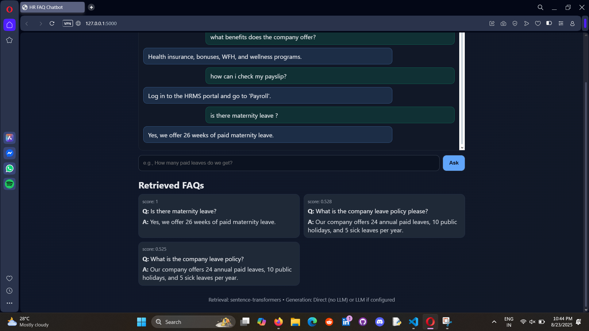

# HR FAQ Chatbot

A **Generative AI powered chatbot** built with Flask that answers HR-related FAQs.
It uses **semantic search** with sentence-transformers to retrieve the most relevant answers, and optionally integrates with **OpenAI models** to generate natural, human-like responses.

This is an example of a **Retrieval-Augmented Generation (RAG)** system, where the chatbot grounds its answers on HR FAQs provided in `faqs.csv`.




## Features

* Semantic FAQ retrieval using embeddings (`all-MiniLM-L6-v2`).
* Generative AI integration with OpenAI (e.g., GPT-4o-mini) for natural responses.
* Falls back to direct FAQ answers if no API key is provided.
* REST API endpoints for asking questions and reindexing FAQs.
* Embedding cache for faster startup.
* Easy to update: just edit `faqs.csv` to change knowledge base.

## Project Structure

```
.
├── app.py              # Main Flask app
├── config.py           # Configuration for OpenAI API key and model
├── faqs.csv            # FAQ dataset (questions and answers)
├── requirements.txt    # Python dependencies
├── templates/
│   └── index.html      # Frontend (if added)
└── faq_index.pkl       # Cached embeddings (auto-generated)
```

## Installation

1. Clone the repository:

   ```bash
   git clone https://github.com/your-username/hr-faq-chatbot.git
   cd hr-faq-chatbot
   ```

2. Create and activate a virtual environment:

   ```bash
   python -m venv venv
   venv\Scripts\activate   # On Windows
   source venv/bin/activate  # On macOS/Linux
   ```

3. Install dependencies:

   ```bash
   pip install -r requirements.txt
   ```

4. Configure OpenAI (for Generative AI responses):

   * Copy `.env.example` to `.env`
   * Add your OpenAI credentials:

     ```
     OPENAI_API_KEY=sk-xxxx
     OPENAI_MODEL=gpt-4o-mini
     ```

   Without this, the chatbot will still work using semantic search.

## Usage

1. Run the app:

   ```bash
   python app.py
   ```

   The app will start on `http://0.0.0.0:5000`.

2. API Endpoints:

   * `POST /ask`
     Request body:

     ```json
     {
       "query": "What is the leave policy?"
     }
     ```

     Response (with OpenAI enabled):

     ```json
     {
       "answer": "Employees are entitled to annual leave as per HR policy...",
       "matches": [
         {"question": "...", "answer": "...", "score": 0.87}
       ]
     }
     ```

   * `POST /reindex`
     Rebuild embeddings if `faqs.csv` is updated.

3. Updating FAQs:

   * Modify entries in `faqs.csv`.
   * Call `/reindex` endpoint or restart the app.

## Dependencies

See `requirements.txt`:

* Flask
* pandas
* numpy
* sentence-transformers
* torch
* OpenAI (Generative AI integration)


## 📢 Author

👨‍💻 **Sarathkumar Soundarrajan**
📌 LinkedIn: (https://www.linkedin.com/in/sarathkumar271002/))
📌 GitHub: (https://github.com/sarathkumar271002)
